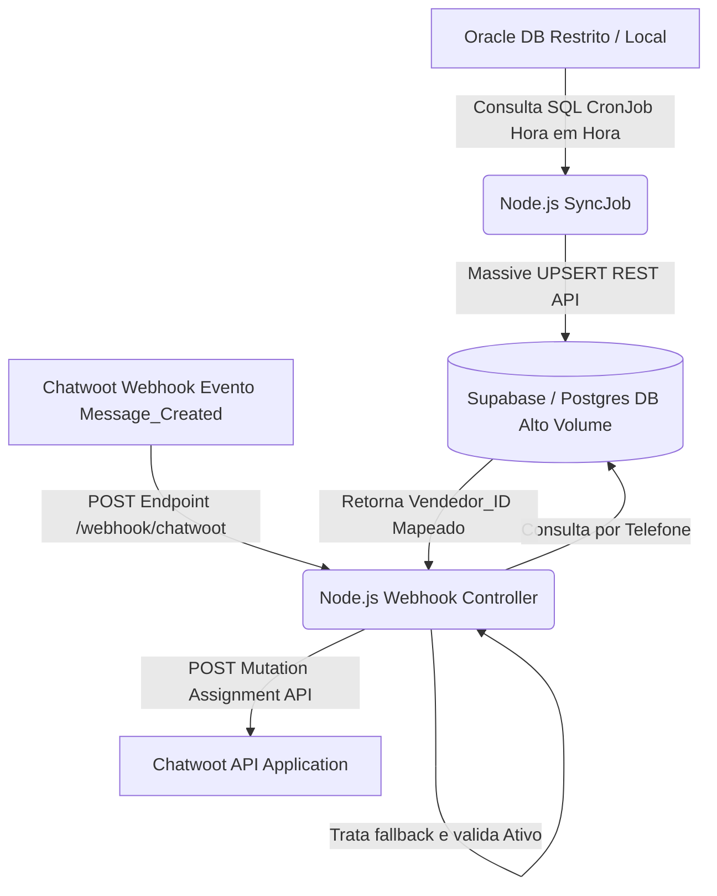

# Arquitetura do Sistema Roteador de Atendimento

O fluxo de dados da aplicação funciona conforme listado abaixo e roda inteiramente dentro de uma VM com NodeJS através do serviço Express. 

## Componentes do Sistema (Modularização)

1. **Controllers**: Camadas de entrada das rotas externas (`webhookController.js`). Retornam o mais rápido possível (<2s) e efetuam ações async secundárias com Chatwoot se for o caso.
2. **Services**: Contém os envoltórios sob protocolos para conversas da API (`chatwootService.js`).
3. **Repositories**: Abstração sob persistência nativa local ou em nuvens (`clienteRepository.js` focado em PostgreSQL).  
4. **Jobs**: Rotinas programadas orientadas a relógio (`syncOracle.js` via node-cron acionando Oracle e Database Repository).
5. **Utils**: Funções puras isoladas para não-repetição, com destaque para a `phone.js` e a adequação regex de números (E.164 => `+55...`).
6. **Config**: Encapsulam a instanciação original, contendo conexao base em `supabase.js` e `oracle.js`. 
7. **App**: Ponto de Ignição unindo `Express` WebServer, Módulo `Cron` e conexões de rotas e banco.
