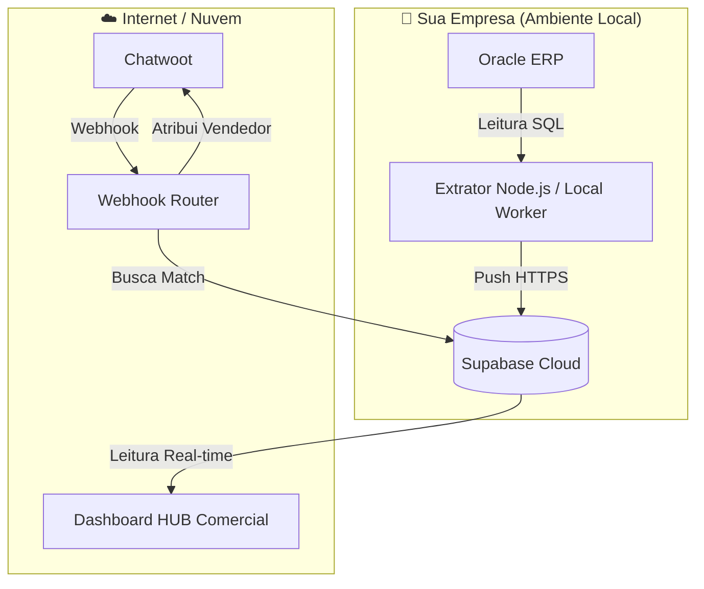

# 🧠 Guia de Integração Híbrida: Oracle Local ↔ Hub na Nuvem

Este projeto foi expandido para uma arquitetura de **Hub de Integrações**. Para que tudo funcione perfeitamente, o sistema foi dividido em duas partes que se comunicam através do seu Banco de Dados na Nuvem (Supabase).

## 📂 Arquitetura do Sistema



---

## 🚀 Passo a Passo para Ativar

### 1. Configure seu Banco na Nuvem (Supabase)
1. Crie um projeto gratuito no [Supabase](https://supabase.com).
2. Vá em **SQL Editor** e cole o conteúdo do arquivo `src/database.sql` que criei para você. Isso criará a tabela de clientes.
3. Vá em **Settings > API** e pegue a `URL` e a `Service Role Key`.

### 2. Configure o Extrator Local (Sincronizador Oracle)
Este módulo deve rodar em um computador/servidor dentro da sua empresa que tenha acesso ao Oracle.
1. Na pasta raiz do projeto, renomeie `.env.example` para `.env`.
2. Preencha as credenciais do seu **Oracle** e as chaves do **Supabase** que você pegou no passo anterior.
3. No terminal da pasta raiz, execute:
   ```bash
   npm install
   npm run dev
   ```
   *O sistema começará a subir os dados do Oracle para o Supabase a cada 1 hora.*

### 3. Configure o Dashboard Visual (Frontend)
Este é o painel bonito para você e sua equipe gerenciarem as integrações.
1. Entre na pasta `dashboard`.
2. Crie um arquivo `.env` dentro da pasta `dashboard` (ou use variáveis de ambiente no seu provedor de hospedagem como Vercel/Netlify):
   ```
   VITE_SUPABASE_URL=SUA_URL_DO_SUPABASE
   VITE_SUPABASE_ANON_KEY=SUA_ANON_KEY_DO_SUPABASE
   ```
3. Execute:
   ```bash
   npm install
   npm run dev
   ```
4. Agora você pode ver seus clientes do Oracle aparecendo em tempo real em uma interface Premium!

---

## 🔌 Como integrar outros sistemas?

Como agora todos os seus dados do Oracle estão "vivos" no Supabase:
1. **No n8n:** Você pode simplesmente usar o nó do Supabase para ler clientes e enviar e-mails, criar leads no RD Station, etc.
2. **No Chatwoot:** O roteamento já está pronto! Aponte o Webhook do Chatwoot para a URL onde você hospedou o seu servidor Node.js (Webhook Router).

## 💡 Dica de Expert
Para manter o **Extrator Local** rodando 24h sem interrupção no Windows, recomendo usar o [PM2](https://pm2.keymetrics.io/):
```bash
npm install pm2 -g
pm2 start src/app.js --name "extrator-oracle"
pm2 save
```

Isso garante que se o computador reiniciar, o extrator volte a funcionar sozinho!
